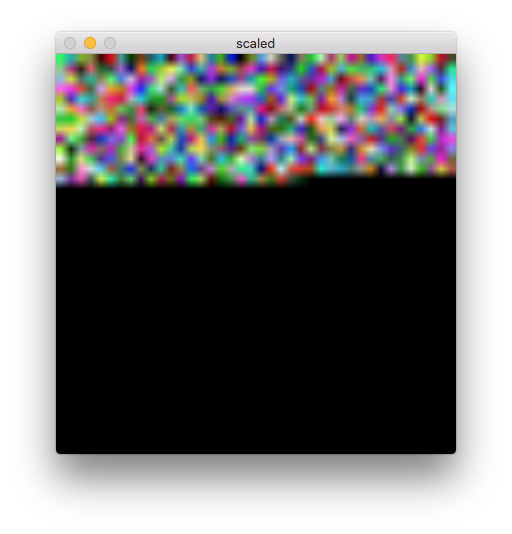
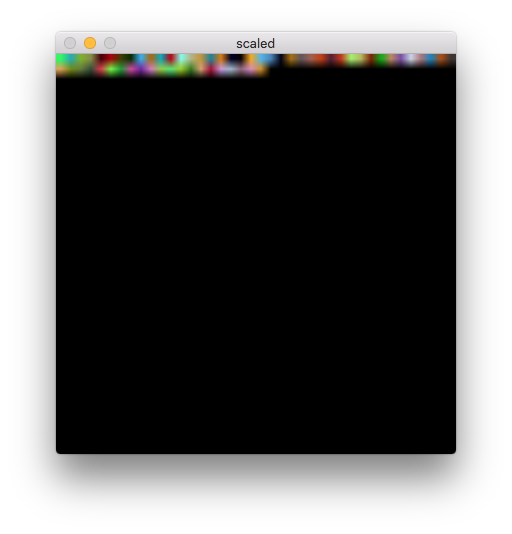

# packet_to_image




パケットを画像データとして無理やりデコードする。
指定したインタフェースに流れるパケットすべてを画像化する。

画像化するためにOpenCVを用いる。
clickとOpenCVを連携させるために、configureを行う際にリスト`configure`に示すオプションを渡す。

````
./configure CXXFLAGS="`pkg-config --cflags --libs opencv`"
````
このオプションにより、OpenCVがリンクされる。

こんな感じに使う。
`FromDevice(en0)->Imager->Discard;`
